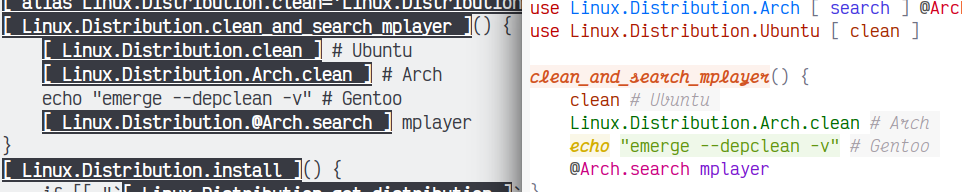

# Seashell 2

Just for coding shell (zsh/bash) script more happily!

## Overview

**Modularized Shell Programming**

``` bash
# Your file in src dir: src/Linux/Distribution.sh
use Linux.Distribution.Arch [ search ] @Arch
use Linux.Distribution.Ubuntu [ clean ]

clean_and_search_mplayer() {
    clean # Ubuntu
    Linux.Distribution.Arch.clean # Arch
    echo "emerge --depclean -v" # Gentoo
    @Arch.search mplayer
}

# Your file in src dir: src/Linux/Distribution/Arch.sh
search() { ... }
clean() { ... }

# Your file in src dir: src/Linux/Distribution/Ubuntu.sh
clean() { ... }
```

**Reuse Simply**

``` bash
# Your file in bin dir: bin/demo.sh
Linux.Distribution.clean_and_search_mplayer
```

Then execute this shell script: `$SHELL bin/demo.sh`.

**Only Shell Script Code, But More Powerful**

The command`seashellize bin/demo.sh -d` will show how the Seashell work.



**Make A Single File And Run Without Any Dependency**

Generate a standalone script: `seashellize bin/demo.sh > all_in_one.sh`. Then you can execute the command like `bash all_in_one.sh` in your cloud or your server.

**Return Value**

``` bash
search() {
    var package_name="`search_package $1`"
    var package_name_list=( "`search_package_list $1`" )
    echo "Arch package search: < $package_name >"
    echo "Arch package list search: [ ${package_name_list[@]} ]"
}

search_package() {
    echo "Searching Package $1"
    local result="$1"
    ret "$result"
    echo "Doesn't Display"
}

search_package_list() {
    echo "Searching Package List $1"
    declare -a result=( "$1-1" "$1-2" "$1-3" )
    ret ( "${result[@]}" )
    echo "Doesn't Display"
}
```

**Macro Ability (Todo)**

I don't have a good idea to make shell script support macro. Because of the weak syntax of bash/zsh language, maybe I will implement it like that:

``` bash
!macro{a:@b:%c}() {
  ...
}
# !macro{a:@b:%c} is a right syntax of zsh/bash
# !macro is a macro
# a is a scalar variable $a
# @b is a array variable $b
# %c is a assoc array variable $c
```

## Feature

- Module (multiple module work togather)
- Namespace (import and isolation)
- Archive Script (dependency resolve)
- Return Scalar And Non-Scalar (ret and var)
- Disable Echo As Return Value (ret and var)
- Project Helper Script (seashellize and seashellist)
- Interactive (Todo: seash)
- Macro (Todo: !macro)

## Usage

### Prepare Environment

#### Shell Version

- zsh >= 4 or bash >= 4
- sed >= 4 (gnu version)

#### Shell Option

These options has been set by the Seashell.

- expand_aliases (bash)
- errexit (zsh/bash)
- pipefail (zsh/bash)

### Install Seashell

1. Clone the repository

   ``` bash
   git clone https://github.com/chongwish/seashell2 $seashell_path_you_want
   ```

2. Define the environment variable of the absolute path of Seashell

   ``` bash
   export SEASHELL_HOME="$absolute_path_of_seashell_you_define"
   ```

3. Test whether Seashell can work

   ``` bash
   $SEASHELL_HOME/bin/seashellize example/bin/demo.sh -d
   ```

   Seashell works when nothing error happen.

### Restrain Name

#### Namespace Naming Conventions

Upper Camel Case.  To concatenate them with the char ".":

``` bash
Abc.Bcd
```

#### Function Naming Conventions

Alphabet or "\_" or digit:

``` bash
fn_name_1
```

### Define Module

#### Structure

```
.
├── bin/                  # script entry
├── mod                   # module defination
├── src/                  # library
└── vendor/               # third-party module
```

#### Helper

You can create your module files manually. But Seashell has a script whose name is "seashellist" to help you create the file.

``` bash
$SEASHELL_HOME/bin/seashellist -n Abc.Bcd
```

And then, a file whose name is "Bcd.sh" was created at the place `./src/Abc`.

### Run Script

Nothing different from before you run the shell script without Seashell.

``` bash
$SHELL bin/your_script.sh
```

Or, you will place a single script file to somewhere because your don't like to copy too many files. But, your script can't run without your library, third-party module and Seashell. So, we can merge them to be a single script file:

```bash
$SEASHELL_HOME/bin/seashellize bin/your_script.sh > $some_where/all_in_one_script.sh
```


